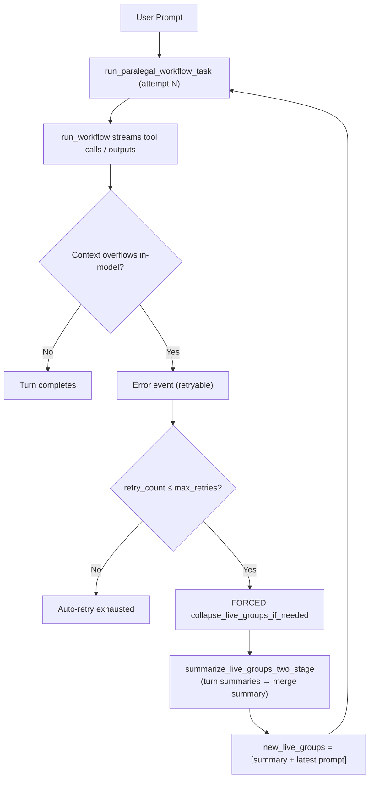
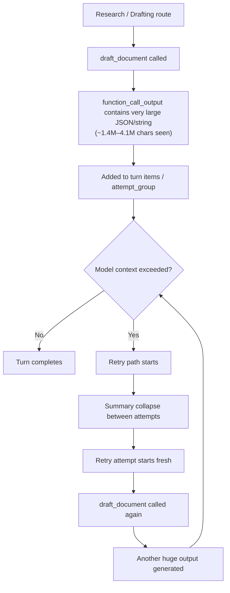
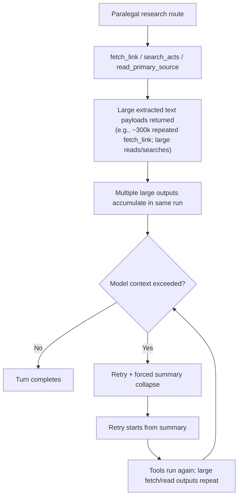

```mermaid
flowchart TD
U["User Prompt"] --> T["run_paralegal_workflow_task (attempt N)"]
T --> W["run_workflow streams tool calls / outputs"]
W --> X{"Context overflows in-model?"}

X -- "No" --> OK["Turn completes"]
X -- "Yes" --> E["Error event (retryable)"]
E --> R{"retry_count ≤ max_retries?"}

R -- "No" --> F["Auto-retry exhausted"]
R -- "Yes" --> C["FORCED collapse_live_groups_if_needed"]
C --> S["summarize_live_groups_two_stage<br/>(turn summaries → merge summary)"]
S --> N["new_live_groups = [summary + latest prompt]"]
N --> T
```

# part 2

```mermaid
flowchart TD
  A1["Research / Drafting route"] --> A2["draft_document called"]
  A2 --> A3["function_call_output contains very large JSON/string<br/>(~1.4M–4.1M chars seen)"]
  A3 --> A4["Added to turn items / attempt_group"]
  A4 --> A5{"Model context exceeded?"}

  A5 -- "No" --> AOK["Turn completes"]
  A5 -- "Yes" --> A6["Retry path starts"]
  A6 --> A7["Summary collapse between attempts"]
  A7 --> A8["Retry attempt starts fresh"]
  A8 --> A9["draft_document called again"]
  A9 --> A10["Another huge output generated"]
  A10 --> A5
```

# part 3

```mermaid
flowchart TD
  B1["Paralegal research route"] --> B2["fetch_link / search_acts / read_primary_source"]
  B2 --> B3["Large extracted text payloads returned<br/>(e.g., ~300k repeated fetch_link; large reads/searches)"]
  B3 --> B4["Multiple large outputs accumulate in same run"]
  B4 --> B5{"Model context exceeded?"}

  B5 -- "No" --> BOK["Turn completes"]
  B5 -- "Yes" --> B6["Retry + forced summary collapse"]
  B6 --> B7["Retry starts from summary"]
  B7 --> B8["Tools run again; large fetch/read outputs repeat"]
  B8 --> B5

```
